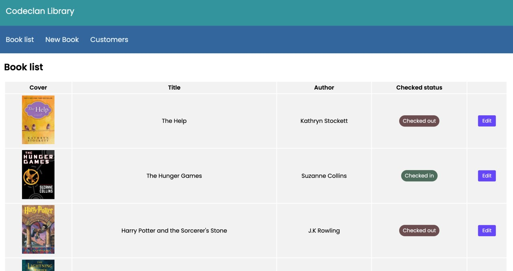
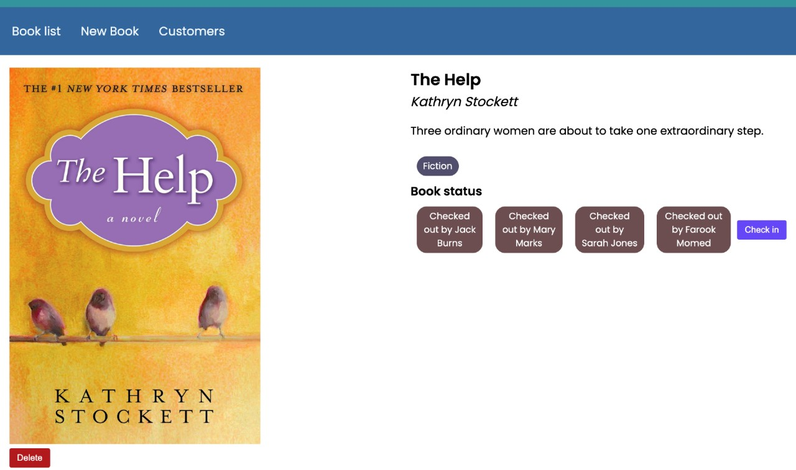
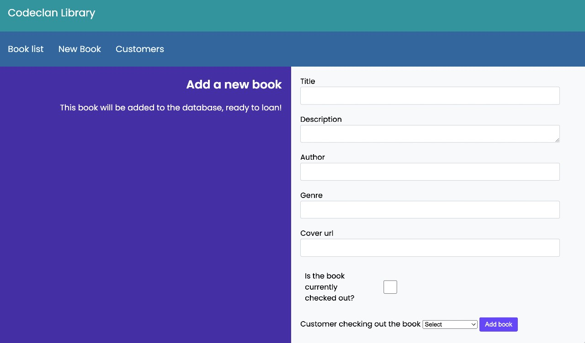
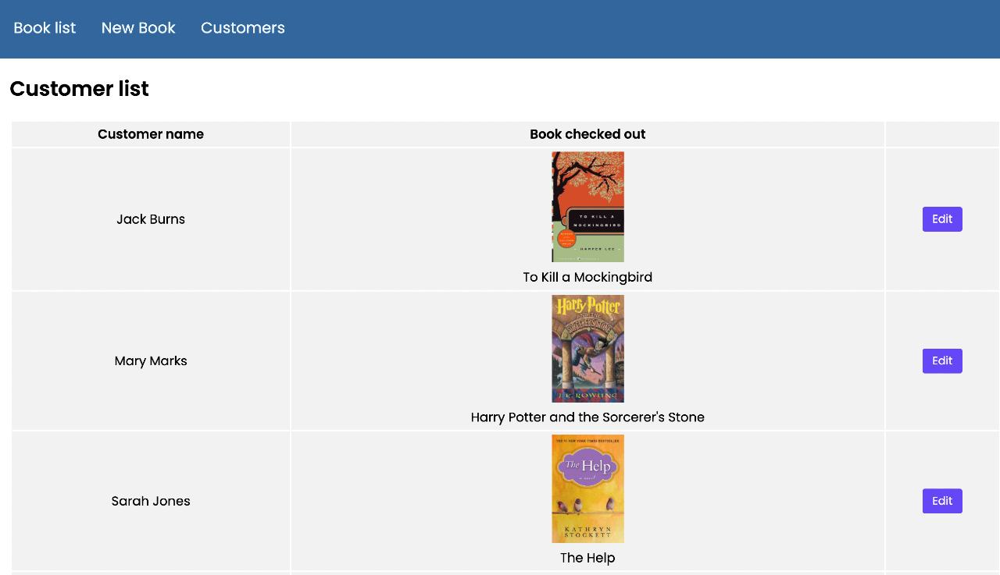

# Create a Library in Flask

We were tasked to create a library where an admin user can create a book in the library.

## The MVP required the following functionality:

- List all Books
- Show an individual Book
- Add a new Book to the Library.
- Remove a Book from the Library

## Additional functionality

- Show if the book is checked out or not
- Add CSS styling

## I added these features

- Created a user class
- Tie a book to a user
- Show who's currently got a book on loan
- Return a book from a user
- Create a unique reference number (urn) for each book and user, which is also used for the URL for the books
- CSS grid and Flexbox and basic mobile responsive

## Some screenshots

